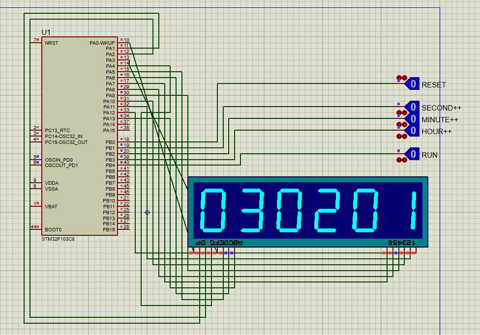

# SevenSegmentClock

Welcome to the SevenSegmentClock repository! This project aims to build a clock using a 6-digit seven-segment display and an STM32F103C8 microcontroller. The clock allows you to display and manipulate time using buttons.

## Contents

- [Project Overview](#project-overview)
- [Hardware Requirements](#hardware-requirements)
- [Software Requirements](#software-requirements)
- [Simulation](#simulation)
- [Getting Started](#getting-started)
- [Contributing](#contributing)
- [License](#license)

## Project Overview

The SevenSegmentClock project utilizes an STM32F103C8 microcontroller to control a 6-digit seven-segment display. With the provided code, you can display the current time, set the time using buttons, and explore additional clock functionalities.

## Hardware Requirements

To replicate this project, you will need the following components:

- STM32F103C8 microcontroller
- 6-digit seven-segment display
- Buttons for time manipulation
- Appropriate resistors, capacitors, and wiring

## Software Requirements

Ensure you have the following software installed:

- STM32CubeIDE: Integrated Development Environment for STM32 microcontrollers
- Proteus: Simulation software for electronics and embedded systems

## Simulation

The `Simulation` folder contains the Proteus simulation file for the SevenSegmentClock project. You can use this file to simulate the project before implementing it on the hardware.

## Getting Started

To get started with the SevenSegmentClock project:

1. Clone this repository to your local machine.
2. Open the project in STM32CubeIDE.
3. Build the project and flash it onto your STM32F103C8 microcontroller.
4. Connect the hardware components according to the provided circuit diagram.
5. Power up the circuit and start enjoying your SevenSegmentClock!

## Contributing

Contributions to this project are welcome! If you have any improvements, bug fixes, or new features to suggest, please feel free to submit a pull request.

## License

This project is licensed under the [MIT License](LICENSE). Feel free to use and modify the code according to the terms of the license.

